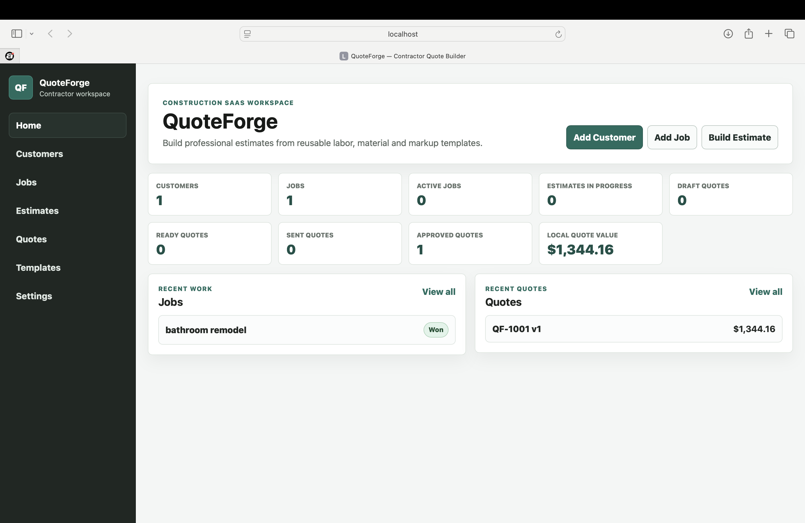
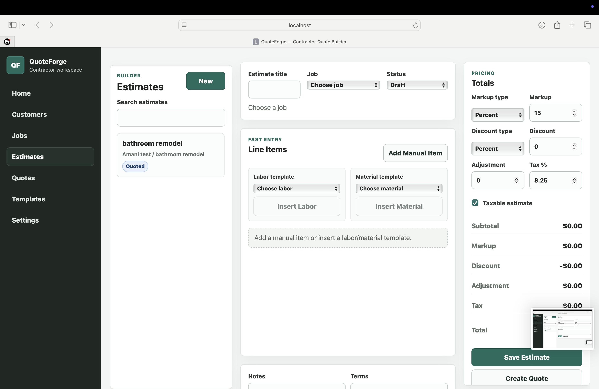
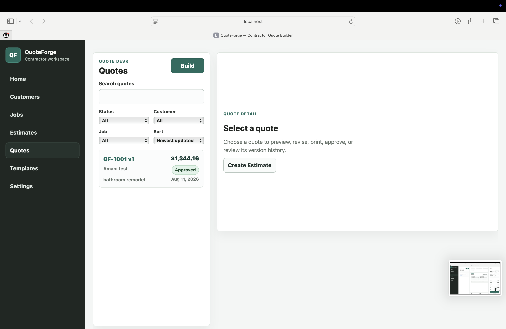
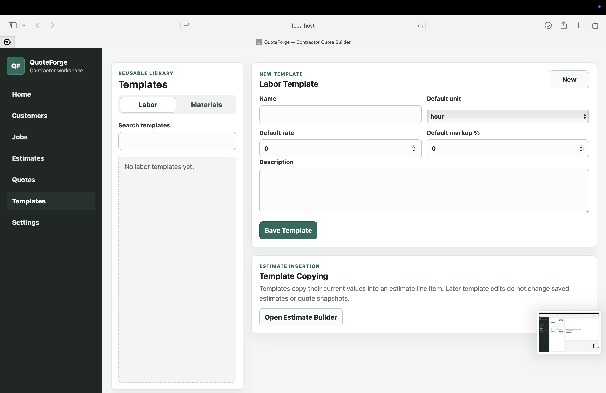
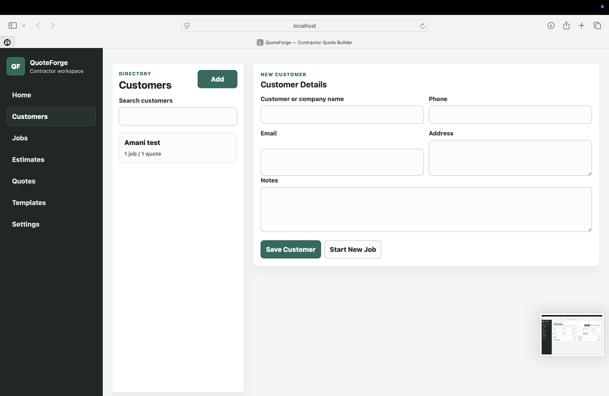

# QuoteForge

**Contractor estimating and quote management software for small service businesses.**

QuoteForge is a local-first business application designed for contractors, handymen, and service trades that need a cleaner way to manage customers, jobs, estimates, reusable pricing templates, quote revisions, approvals, and printable quotes.

> This repository is a **public product showcase only**. The commercial application source code is kept private.

## Product Preview

## The Problem

Small contractors often build estimates from scattered notes, spreadsheets, text messages, and repeated material lists. That makes pricing slower, quote history harder to track, and revisions easy to lose.

QuoteForge brings the workflow into one organized workspace:

**Customer → Job → Estimate → Quote → Revision → Approval → Print / PDF**

## Core Features

- Customer directory with linked jobs and quote history
- Job pipeline with statuses and activity tracking
- Estimate builder for labor, materials, equipment, and other costs
- Reusable labor and material templates
- Pricing calculations for markup, discounts, adjustments, and tax
- Quote numbering and immutable quote snapshots
- Quote revisions and version history
- Approval and rejection tracking
- Printable / PDF-ready quote layouts
- Local backup and restore through JSON export/import
- Responsive business-focused interface
- Automated tests around pricing, quote versioning, validation, and persistence

## Screenshots

| Estimates | Quotes |
| --- | --- |
|  |  |

| Templates | Customers |
| --- | --- |
|  |  |

## Designed For

QuoteForge is aimed at small service businesses such as:

- General contractors
- Handymen
- Electricians
- Plumbers
- HVAC businesses
- Painters
- Roofers
- Landscapers
- Remodeling teams
- Other quote-driven service businesses

## Technology

The current web product is built with:

- React
- Vite
- JavaScript
- Plain CSS
- Browser localStorage
- Node-based domain tests

A separate React Native + TypeScript mobile companion has also been developed for mobile workflows.

## Product Direction

The current version is intentionally local-first. This keeps the application simple, private, and usable without requiring a hosted backend.

Future commercial variants may include:

- Trade-specific template packs
- Hosted database and authentication
- Team accounts
- Cloud sync
- Customer portals
- Deeper reporting
- Payment or accounting integrations
- Industry-specific editions such as landscaping, cleaning services, and auto repair

## Commercial Use

The full QuoteForge implementation is maintained privately while the product is prepared for commercial licensing and customization.

This public repository exists to demonstrate the product, workflow design, interface, and development capabilities without distributing the commercial source code.

## About the Developer

Built by **Amani Robinson**, a React developer focused on business applications, dashboards, workflow tools, CRM-style systems, and operational software.

---

**QuoteForge** — turning scattered quoting workflows into organized business software.

All rights reserved.
